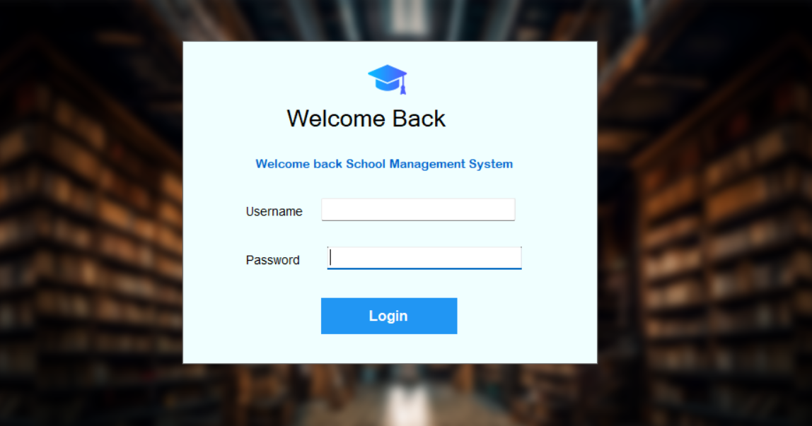
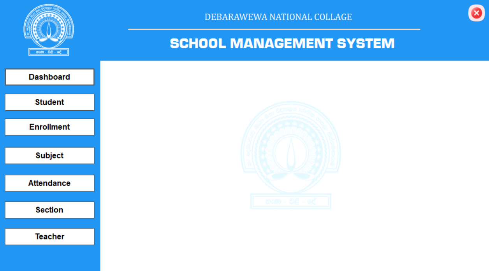
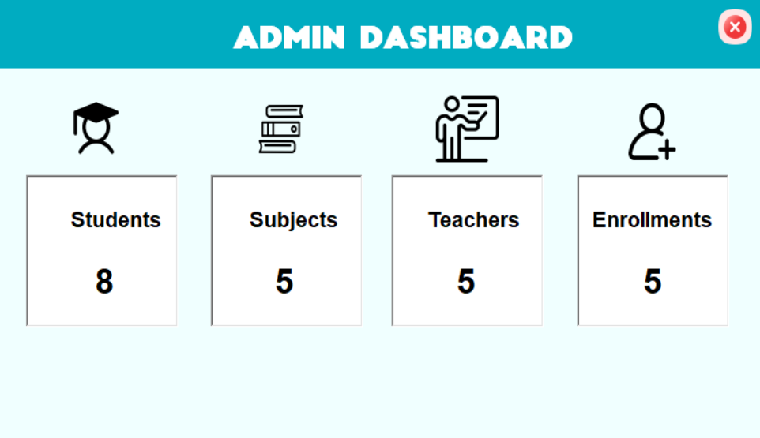
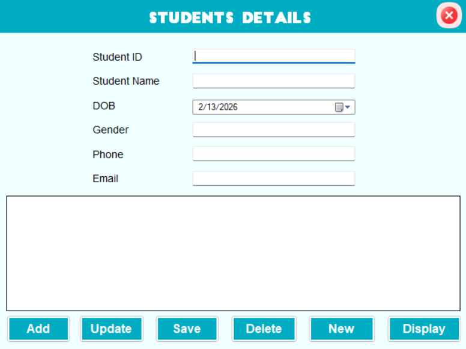
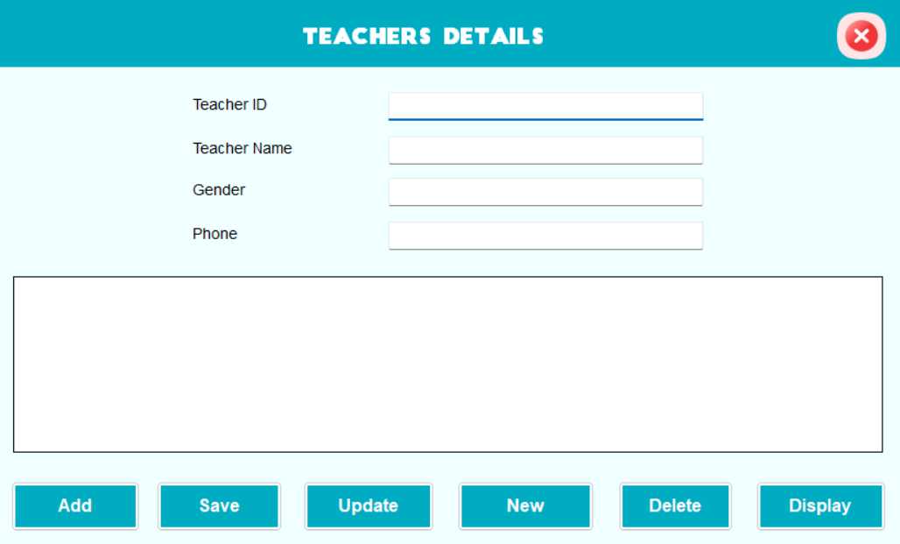
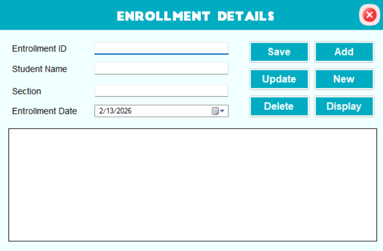
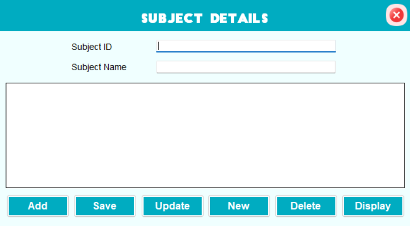
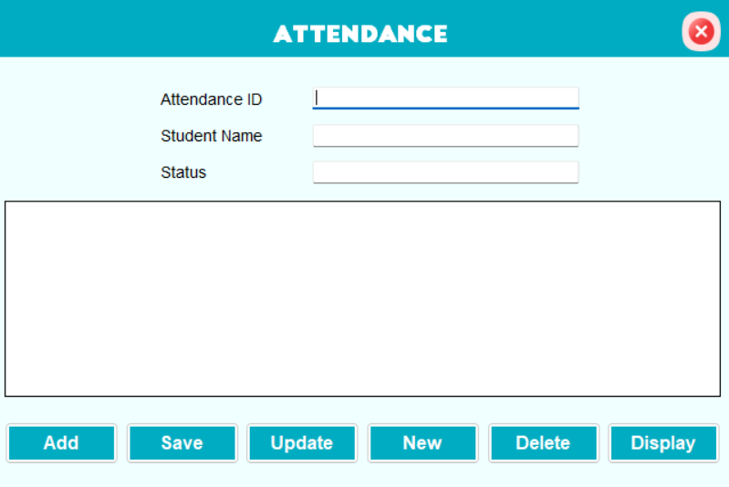

# Student Management System (C# WinForms)

A robust desktop application designed to automate school administrative tasks, including student registrations, attendance management, and etc.... This project was developed as a **Group Project (Group J)** for the **Visual Programming I )** module.

## Project Overview
The system provides a centralized platform for educational institutions to manage student data, teacher assignments, and daily attendance records through a user-friendly GUI.

## Key Features
* **Student & Teacher Management:** Efficiently manage profiles for both students and staff.
* **Attendance Tracking:** Automated system to record and monitor student attendance.
* **Enrollment & Subjects:** Handle student enrollments and manage academic subjects/sections.
* **Interactive Dashboard:** A comprehensive main interface for quick navigation between modules.

## Tech Stack
* **Language:** C#
* **Framework:** .NET WinForms
* **Database:** SQL Server (utilizing `schoolDB.mdf`)
* **IDE:** Visual Studio

## Getting Started
1. Clone this repository to your local environment.
2. Open the solution file `SchoolManagement.sln` in **Visual Studio**.
3. Execute the provided SQL script `db_script.sql` to set up the **schoolDB** database schema and sample data.
4. Build and run the application.

## Application Screenshots

### Secure Login Interface

### Main Dashboard

### Student & Teacher Management

### Enrollment System

### Subject Management

### Attendance Tracking System

---
*Developed by Group J - University of Vocational Technology (UoVT) - Department of Software Technology*
